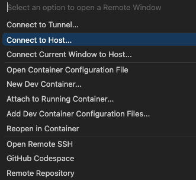
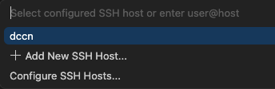
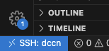
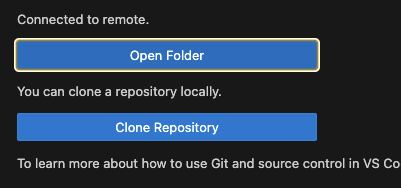
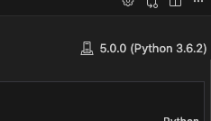

# Stijn's Guide to Running Jupyter Notebooks on a DCCN Compute Node in VSCode

If you're anything like me, you like the following things:
1. Science
2. Jupyter notebooks (although this is a love-hate relationship)
3. The DCCN's compute clusters
4. VSCode [^1]

So what if I told you that there is a way to get all four of these together in a single workflow? Well, it is true, and this is my guide to help you set this up for yourself.

At the end of this guide, you will have a setup that allows you to easily start a job on the DCCN compute cluster, and use that to power a jupyter notebook in your local VSCode client. You will be able to load big datasets and do heavy computations on them with the flexibility of the notebooks and the snappy experience of a locally running IDE. Because ergonomics is more than an adjustable desk chair. Let's go.

[^1]: It's not easy for me to admit that I like something that is made by Microsoft, but here's the thing: VSCode is quasi-open source, and it has a community-driven marketplace with thousands of useful and free extensions, which together just make it a great app. It can support every language, is highly customizable, and it has no Microsoft logos anywhere! It's no wonder that it is securely crowns [StackOverflow's list of most popular IDE's](https://survey.stackoverflow.co/2024/technology#1-integrated-development-environment).

## Requirements
To succesfully complete this guide, you will need the following things already set up:
1. EduVPN
    - [Setup instructions](https://hpc.dccn.nl/docs/cluster_howto/access-external-eduvpn.html)
     - Email helpdesk@donders.dccn.nl for support, they can help you set this up. 
2. An installation of VSCode with the 'Remote - SSH' extension installed 
    - [Download VScode here](https://code.visualstudio.com/download)
    - [Install the 'Remote - SSH' extension here](https://marketplace.visualstudio.com/items?itemName=ms-vscode-remote.remote-ssh)
3. An account on the DCCN cluster

## Part 1: You should only have to do this once

First of all, we're going to make it very easy to access the cluster by setting up SSH keys. We're going to do this by generating a public and private key pair, and adding the public key to the cluster. This will not only make it faster to access the cluster, but it will also make it more secure, as you will not have to enter your password every time you want to access the cluster, and the ssh keys are much more difficult to crack than a password.

### 1.1. Setup a public and private key pair for SSH access 🔑

For this entire guide, we're going to use the `mentat005.dccn.nl` node. This is a login node that support SLURM job submission. 

We're also going to use a mock username `<username>` for the entire guide. You should replace this with your own username when you're actually running the commands. For example, if your username is `frodobaggins`, you should replace `<username>` with `frodobaggins` in all the commands.

<details>
<summary>1.1.1 Activate EduVPN</summary>

First, you need to activate EduVPN with a 'Radboud Institue' profile or a 'RU Donders Institute Trigon (Full Access)' profile. You can find the setup instructions [here](https://hpc.dccn.nl/docs/cluster_howto/access-external-eduvpn.html).

Test your connection by trying to SSH into the cluster:
```bash
ssh <username>@mentat005.dccn.nl    
```
This will prompt you to enter your password. This is the password you use to log into the cluster. Once you have entered your password, you should be able to access the cluster.
</details>

<details>
<summary>1.1.2 Generate a public and private key pair</summary>

Now we're going to generate a public and private key pair. This is a one-time setup, and you should only have to do this once. We're going to use the `ssh-keygen` command to generate a public and private key pair. You can use the following command to generate a public and private key pair:
```bash
ssh-keygen -f ~/.ssh/id_rsa
```
This will generate a public and private key pair in the `~/.ssh` directory. You can decide to encrypt the private key with a passphrase, but this is not necessary for the setup to work. If you want to learn about the implications of not setting up a passphrase, you can read [this](https://security.stackexchange.com/questions/183636/ssh-keygen-what-is-the-passphrase-for). 

After running this command, you should see a message like this:
```bash
Your identification has been saved in /Users/<username>/.ssh/id_rsa
Your public key has been saved in /Users/<username>/.ssh/id_rsa.pub
The key fingerprint is:
SHA256:<fingerprint> <username>@mentat005.dccn.nl (RSA)
```
Remember the path to the public key (the one with the `.pub` extension), as we're going to need it for the next step.
</details>

<details>
<summary>1.1.3 Add the public key to the cluster</summary>

Now we're going to add the public key to the cluster. This will allow you to access the cluster without having to enter your password every time.

We're going to use the `ssh-copy-id` command to add the public key to the cluster. You can use the following command to add the public key to the cluster:
```bash
ssh-copy-id -i ~/.ssh/id_rsa.pub <username>@mentat005.dccn.nl
```
This will add the public key to the cluster.

Running this command will prompt you to enter your password. This is the password you use to log into the cluster. Once you have entered your password, the public key will be added to the cluster.
</details>


<details>
<summary>1.1.4 Test the setup</summary>

Now we're going to test the setup. We're going to try to SSH into the cluster using the private key we just generated. You can use the following command to test the setup. First make sure that you're logged out of the cluster, either by closing the terminal or by running the `exit` command:
```bash
exit
```

Then, you can try to SSH into the cluster again, using the familiar command:
```bash
ssh <username>@mentat005.dccn.nl
```

If it all works as it should, you should no longer have to enter your password when you SSH into the cluster, but instead get access to the cluster directly. Nice!
</details>

<details>
<summary>1.1.5 Optional: Add the DCCN node to the SSH config</summary>

If you want even easier access, you can add the DCCN node to the SSH config. This will allow you to SSH into the cluster by simply running `ssh dccn`. Go to the `~/.ssh/config` file and add the following lines:
```bash
Host dccn
    HostName mentat005.dccn.nl
    User <username>
    IdentityFile ~/.ssh/id_rsa
```
Now you can test your setup by running `ssh dccn`.

</details>

### 1.2 Create a job submission script
Now we're going to create a job submission script that will run every time you want to start the job that will power your jupyter notebook. 

<details>
<summary>1.2.1 Connect to the cluster using VSCode</summary>

Open VSCode, and click on the blue rectangle in the bottom left corner. 


This should open a dialog box with several options. Click on the 'connect to host' option. 



This should open another dialog, prompting you for the host you want to connect to. If you've configured the host in step 1.1.5, you can simply click `dccn` here. 



Otherwise, you have to enter `<username>@mentat005.dccn.nl` manually and hit enter. 

This should open a new VScode window, and after some loading, you should have a connection to the cluster. The blue rectangle in the bottom left corner should now say `SSH:dccn` or `SSH: <username>@mentat005.dccn.nl` depending on what you've configured.



Now in the VSCode window that just opened, click on the 'Open Folder' icon in the left sidebar. 



This will open a dialog box prompting you for the folder you want to open. The home folder should be pre-filled, but you can go to your project directory from here. This should reload the window, and you should see the contents of your project directory in the left sidebar.  

</details>

<details>
<summary>1.2.2 Create a conda environment</summary>

Now we're going to create a conda environment that will contain all the dependencies for your jupyter notebook. Open the integrated terminal in VSCode by pressing `Ctrl+Shift+P` (or `Cmd+Shift+P` on Mac) and typing `Terminal: Open Integrated Terminal`. You can use the following commands to create the environment:

```bash
module load anaconda3
conda create -n <env_name> python=3.12
conda activate <env_name>
conda install -c conda-forge jupyter
python -m ipykernel install --user --name <env_name> --display-name "Python (<env_name>)"
```
You should replace `<env_name>` with a name for your environment. I recommend using a name that is related to the project you're working on.

We need to set a password for the jupyter notebook. You can do this by running the following command:

```bash
jupyter notebook password
```

You will be prompted to enter a password, and then to confirm it. This will set a password for the jupyter notebook. You will need to remember this password, as you will have to enter it every time you want to start the jupyter notebook.
</details>
<details>

<summary>1.2.3 Set a Jupyter password</summary>

We have to set a password for the jupyter notebook. Activate the conda environment by running the following command:

```bash
source activate <env_name>
```

Then, you can set the password by running the following command:

```bash
jupyter notebook password
```

You will be prompted to enter a password, and then to confirm it. This will set a password for the jupyter notebook. You will need to remember this password, as you will have to enter it every time you want to start the jupyter notebook.
</details>
<details>

<summary>1.2.4 Create a job submission script</summary>

Now open the command palette by pressing `Ctrl+Shift+P` (or `Cmd+Shift+P` on Mac). Type `new file` and hit enter. You'll see a new file appear in the left sidebar, and you should name it `jupyter_<project_name>.sh`, and replace `<project_name>` with the name of your project. Note that this file should be in your projects' source directory.

Now you can start writing the script. The script should be a bash script that will run the jupyter notebook. You can use the following template:

```bash
#!/bin/bash
#SBATCH --job-name=jupyter
#SBATCH --cpus-per-task=4
#SBATCH --mem=16G
#SBATCH --time=04:00:00
#SBATCH --output=<project_dir>/logs/slurm-jupyter-%j.out

module load anaconda3
source activate <env_name>

jupyter notebook --no-browser --ip=0.0.0.0 --port=8888
```
And make the file executable by running the following command:
```bash
chmod +x jupyter_<project_name>.sh
```

Make sure that you replace the `<project_dir>` with the path to your project directory. This is the directory that contains the notebooks you want to run. Also ensure that the `logs` directory exists, as this is where the job output will be written to.

You can adjust the requirements in the file to your needs. The DCCN's instructions on specifying resource requirements can be found [here](https://hpc.dccn.nl/docs/cluster_howto/compute_slurm.html#specifying-resource-requirements). Those instructions are only for direct command line submissions, but the keywords for in the script can be found in the slurm documentation [here](https://slurm.schedmd.com/documentation.html) and more specifically [here](https://slurm.schedmd.com/pdfs/summary.pdf).
</details>


<details>
<summary>1.2.5 Test the setup</summary>

We can test the setup by running the job submission script. Open the integrated terminal in VSCode by pressing `Ctrl+Shift+P` (or `Cmd+Shift+P` on Mac) and typing `Terminal: Open Integrated Terminal`. Then, make sure that your terminal is also in the project folder. Run the script by running the following command:

```bash
sbatch jupyter_<project_name>.sh
```

Then, run the following command to check if your job is running:
```
squeue --me
```

And you should see your job output in the `logs` directory. 

If this all checks out, kill the job by running the following command:
```bash
scancel <job_id>
```
</details>

## Part 2: You should do this every time


Now we're all set up to start working. From now on, every time you want to start a notebook on the cluster in your local VSCode, you should do the following:


<details>
<summary>2.1.1 Start Eduvpn</summary>

Start Eduvpn and connect to the DCCN network.

</details>

<details>
<summary>2.1.2 Connect to the cluster using VSCode</summary>

Open VSCode and connect to the cluster. 

Pro tip: `Ctrl+R` opens a list of recent projects in VSCode. If you've recently opened a project on the cluster, this should also be listed, and clicking it will connect to the remote and open the folder. Super easy!

If not, you can also connect to the cluster manually using the instructions in step 1.2.1.

</details>

<details>
<summary>2.1.3 Run the job submission script</summary>

Now we're going to run the job submission script. Open the integrated terminal in VSCode by pressing `Ctrl+Shift+P` (or `Cmd+Shift+P` on Mac) and typing `Terminal: Open Integrated Terminal`. Move into the directory where you put the job submission script, and run the script:

```bash
sbatch jupyter_<project_name>.sh
```
This will submit the job to the cluster, and you should see the job ID in the terminal:

```
Submitted batch job 0123456789
```
Note down the job ID, as we will use it in the next step.

</details>

<details>
<summary>2.1.4 Read the jupyter output</summary>

In our job submission script, we specified that the output of the job should be written to the `logs` directory. We now need the output of the job to connect to the notebook. You can do this by running the following command:

```bash
cat logs/slurm-jupyter-<job_id>.out
```
Where you should replace `<job_id>` with the job ID you noted down in step 2.1.3.

Note that it may take some time for the job to start and to produce the output. You can use `watch` to check the output of the job:
```bash
watch -n 1 cat logs/slurm-jupyter-<job_id>.out
```
This will update the output of the job every second.
Once it starts, somewhere in the output, you should see something like this:
```bash
[I 2025-06-06 16:59:01.094 ServerApp] Jupyter Server 2.16.0 is running at:
[I 2025-06-06 16:59:01.094 ServerApp] http://dccn-c044.dccn.nl:8888/tree
[I 2025-06-06 16:59:01.094 ServerApp]     http://127.0.0.1:8888/tree
```
Take note of the first URL, as we will use this to connect to the notebook. You can exit the `watch` command by pressing `Ctrl+C`.

</details>

<details>
<summary>2.1.5 Connect to the notebook</summary>

Now we're going to connect to the running notebook server from the notebook that we want to work in. So, open that notebook (in VsCode), and click on the mysterious symbol in the top right corner:



Click:
```
Select Another Kernel -> Existing Jupyter Server
```
Then, enter the URL of the notebook server you noted down in step 2.1.4 and hit enter. You will be prompted for your password, so enter it. 

You will be asked for a display name, and you can enter whatever you think is appropriate, but it's fine to just keep the default.

Now you should get the option to select an environment, and you should select the environment that you created in step 1.2.2.
</details>

<details>
<summary>2.1.6 Test the setup</summary>
In the first cell of the notebook, you should be able to run the following code:

```text
!hostname
```
This should print the hostname of the cluster node that the notebook is running on. For example:

```
dccn-c044.dccn.nl
```

Now we find the path to the python executable that is being used. You can do this by running the following code:

```text
!which python
```
This should print the path to the python executable:

```
/path/to/your/env/bin/python
```
 
If this all checks out, you're all set. Have fun working on your notebook!

</details>
